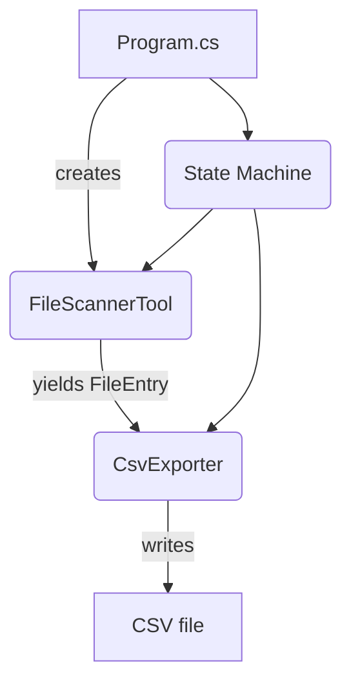
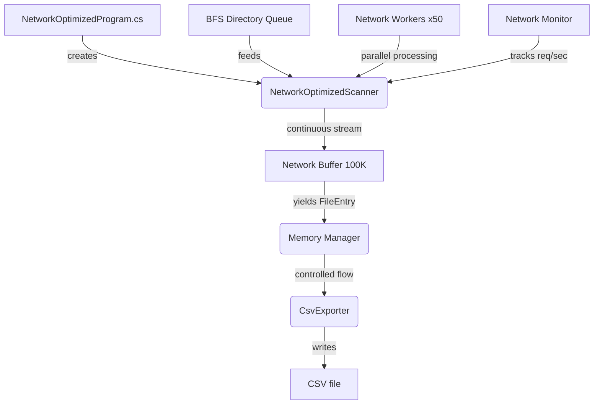
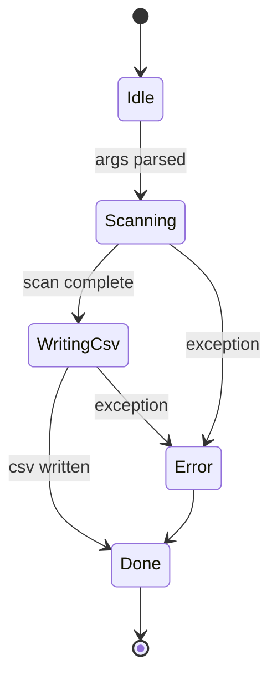

# FileScanner


> **FileScanner** is a cross-platform C#/.NET 9 console utility that **recursively scans directory trees with network-optimized performance, applies powerful filename/extension filters and exports results to CSV**.  
> Features both **standard** and **network-optimized** modes - the latter designed for **constant network utilization** when scanning large servers while preventing stack overflow on deep directory structures.

---

## Table of Contents
1. [Features](#features)
2. [Network-Optimized Mode](#network-optimized-mode)
3. [Quick start](#quick-start)
4. [Command-line reference](#command-line-reference)
5. [Sample output](#sample-output)
6. [Architecture deep dive](#architecture-deep-dive)
7. [Build, test & publish](#build-test--publish)
8. [Troubleshooting / FAQ](#troubleshooting--faq)
9. [Road-map](#road-map)
10. [Contributing](#contributing)
11. [License](#license)

---

## Features

| Area | Details |
|------|---------|
| **Recursive scanning** | Breadth-first traversal avoids deep recursion stack overflows and gracefully skips _access-denied_ / _path-too-long_ errors |
| **Network-optimized** | **Constant network utilization** for large server scanning with configurable concurrency and buffering |
| **Memory management** | Configurable memory limits with automatic garbage collection and partial CSV writing |
| **Filters** | `--contains` substring match on **filename**, `--filter` list of extensions (`.log,.txt`, etc.) |
| **Fast streaming** | No LINQ heavy materialisation – each matching file streams out as a `FileEntry` (lazy iterator) |
| **CSV export** | Escapes commas/quotes, writes header + rows (`FullPath,SizeBytes,LastModifiedUtc`) |
| **State machine** | `Idle → Scanning → WritingCsv → Done` (or `Error`) keeps responsibilities isolated |
| **Self-contained publish** | Single-file `.exe` / ELF / Mach-O bundles – no pre-installed .NET runtime needed |
| **Cross-platform** | Builds & runs on Windows, Linux, macOS (x64/arm64) |

---

## Network-Optimized Mode

> 🚀 **NEW**: Designed for scanning large servers with constant network utilization!

### Why Network-Optimized?

The standard scanner works great for local drives but has limitations on network drives:
- **Bursty network usage** - pulls data "as needed" rather than continuously
- **Server bottlenecks** - waits for server responses, leaving network idle
- **Memory vs Network trade-off** - prioritizes memory safety over network efficiency

### Network-Optimized Solution

**Constant Network Utilization:**
- Large network buffers (50K-100K entries) keep requests flowing
- Multiple concurrent workers maintain steady network activity
- Network monitoring shows real-time req/sec rates

**BFS + Network Streaming:**
- Breadth-first traversal prevents stack overflow on deep trees
- Continuous directory discovery feeds the network pipeline
- Results stream out while network keeps pulling new data

### Key Differences

| Aspect | Standard Mode | Network-Optimized Mode |
|--------|---------------|------------------------|
| **Network Pattern** | Bursty (pull as needed) | **Constant utilization** |
| **Buffer Size** | 1,000 directories | **100,000 file entries** |
| **Memory Usage** | Memory-first | **Network-first with limits** |
| **Concurrency** | 50 tasks | **Configurable (25-200)** |
| **Best For** | Local drives, smaller scans | **Large servers, network drives** |

### Technical Architecture Comparison

#### Standard Mode (FileScannerTool.cs)
```csharp
// Small directory buffer - limits network requests
var dirChannel = Channel.CreateBounded<string>(1000);

// Demand-driven processing - waits for consumer
await foreach (var dir in dirReader.ReadAllAsync(cancellationToken))
{
    await ProcessDirectoryAsync(dir, resultWriter, cancellationToken);
    // Network waits for processing to complete
}
```
**Behavior**: `Memory Safety > Network Efficiency`
- Workers wait for directory channel capacity
- **Blocks network when buffer full**
- Network speed coupled to processing speed

#### Network-Optimized Mode (NetworkOptimizedScanner.cs)
```csharp
// Large file entry buffer - maintains network flow
var networkBuffer = Channel.CreateBounded<FileEntry>(100000);

// Continuous streaming - never waits for consumer
while (!scanningComplete)
{
    if (directoryQueue.TryDequeue(out var directory))
    {
        await ProcessDirectoryBFS(directory, networkBuffer.Writer, ...);
        // Keep network active immediately - no waiting
    }
}
```
**Behavior**: `Network Efficiency > Memory Safety (with limits)`
- Workers maintain independent directory queue
- **Never blocks network activity**
- Network speed decoupled from processing speed

### Task Manager Visualization

**Standard Mode Network Activity:**
```
Network: ████░░░░████░░░░████░░░░  (Bursty - pull as needed)
CPU:     ░░░░████░░░░████░░░░████  (Processing bursts)
Memory:  ██░░░░░░██░░░░░░██░░░░░░  (Conservative usage)
```

**Network-Optimized Network Activity:**
```
Network: ████████████████████████  (Constant utilization)
CPU:     ████████████████████████  (Steady processing)  
Memory:  ████████████████████████  (Managed with limits)
```

### Why This Matters for Large Servers

**Standard Approach Workflow:**
1. Request 1,000 directories → **network active**
2. Process those directories → **network IDLE** ⚠️
3. Request next batch → **network active again**
4. Repeat cycle → **bursty pattern**

**Network-Optimized Workflow:**
1. 50 workers always requesting data → **constant network**
2. 100K buffer absorbs processing delays → **no network pauses**
3. Consumer processes at own speed → **decoupled performance**
4. Memory management prevents overflow → **controlled resource usage**

> **Key Insight**: Standard mode couples network speed to processing speed. Network-optimized mode **decouples them completely** for maximum server throughput.

### Network-Optimized Usage

```bash
# Large server scanning with constant network utilization
dotnet run -- --root "\\bigserver\share" --concurrency 50 --buffer 100000 --memory 1024

# Network drive with conservative settings
dotnet run -- --root "Z:\ServerData" --concurrency 25 --buffer 50000 --memory 512

# Memory-constrained environment
dotnet run -- --root "\\server" --concurrency 10 --buffer 25000 --memory 256
```

**Expected Result:** Task Manager will show **steady network utilization** instead of the stop-and-go pattern of standard mode.

---

## Quick start

### 1. Prerequisites
* [.NET SDK 9 preview](https://dotnet.microsoft.com/download/dotnet/9.0) – `dotnet --version` should print `9.*`

```powershell
# Windows (winget)
winget install Microsoft.DotNet.SDK.9 -e
```

### 2. Clone & run
```powershell
# Clone
 git clone https://github.com/<your-org>/FileScanner.git
 cd FileScanner/FileScanner

# Build
 dotnet build

# Run – scan current directory for every file
 dotnet run --
```

---

## Command-line reference

### Standard Options
| Option | Example | Description |
|--------|---------|-------------|
| `--root <path>` | `--root "D:\Logs"` | Root directory to start scanning (defaults to current working directory) |
| `--contains <substr>` | `--contains error` | Only include files whose **name** (not path) contains this substring (case-insensitive) |
| `--filter <exts>` | `--filter .log,.txt` | Comma/semicolon/space separated list of extensions to include. Dot is optional (`.log` or `log`). |
| `--help` | | Prints basic usage information |

### Network-Optimized Options
| Option | Example | Description |
|--------|---------|-------------|
| `--concurrency <num>` | `--concurrency 50` | Network concurrency level (default: 50, max: 200) |
| `--buffer <num>` | `--buffer 100000` | Network buffer size (default: 100,000, min: 10,000) |
| `--memory <mb>` | `--memory 1024` | Memory limit in MB (default: 1024, min: 256) |

**Order-independent** – options may appear in any order.

> *Tip*: wrap arguments with spaces in quotes, e.g. `--root "C:\Program Files"`.

### Examples

#### Standard Usage
```powershell
# 1) All *.cs files that mention "Program" under the repo
 dotnet run -- --filter=.cs --contains Program

# 2) Deep scan an external drive & save big CSV
 dotnet run -- --root "E:\" --filter .jpg .png .gif
```

#### Network-Optimized Usage
```powershell
# 3) Large server with constant network utilization
 dotnet run -- --root "\\bigserver\data" --concurrency 50 --buffer 100000 --memory 1024

# 4) Network drive with conservative settings (avoid overwhelming network)
 dotnet run -- --root "Z:\SharedData" --concurrency 25 --buffer 50000 --memory 512

# 5) Memory-limited environment
 dotnet run -- --root "\\server\logs" --concurrency 10 --buffer 25000 --memory 256

# 6) High-performance scanning (watch Task Manager network tab!)
 dotnet run -- --root "\\enterprise\archive" --concurrency 100 --buffer 200000 --memory 2048
```

---

## Sample output
```
FullPath,SizeBytes,LastModifiedUtc
"D:\Logs\app-error.log",179232,2025-08-06T04:22:11.0000000Z
"D:\Logs\service-error.log",9912,2025-08-05T19:14:34.0000000Z
```
The CSV is created in the working directory with a timestamped name, e.g. `FileScanResults_20250806_053927.csv`.

---

## Architecture deep dive

### Project layout
```
FileScanner/
├── FileEntry.cs                 // Immutable record: (FullPath, SizeBytes, LastModifiedUtc)
├── FileScannerTool.cs          // Standard BFS scanner + filters
├── NetworkOptimizedScanner.cs   // Network-optimized BFS scanner
├── NetworkOptimizedProgram.cs   // Network-optimized entry point
├── CsvExporter.cs              // CSV writer utility
├── Program.cs                  // Standard entry point, CLI parser, state-machine
└── FileScanner.csproj          // SDK-style project targeting net9.0
```

### Component diagram (Mermaid)

#### Standard Mode


#### Network-Optimized Mode


### State-machine diagram


### How scanning works (step-by-step)

#### Standard BFS Scanning
1. **Queue initial root** → `Queue<string> dirs = new()`; enqueue root.
2. **While queue not empty**  
   a. `Dequeue()` current dir.  
   b. `EnumerateDirectories` → enqueue sub-dirs.  
   c. `EnumerateFiles` → for each file:  
      • check `Contains` filter  
      • check extension set  
      • `yield return new FileEntry(...)`
3. **Caller** (`Program`) materialises results with `ToList()` only once scanning is done.

#### Network-Optimized BFS Scanning
1. **Initialize large network buffer** → `Channel.CreateBounded<FileEntry>(100000)`
2. **Start 50 concurrent network workers** → each maintains constant network activity
3. **BFS directory discovery** → `ConcurrentQueue<string>` feeds workers (no recursion)
4. **Each worker continuously:**
   a. `Dequeue()` directory from BFS queue
   b. **Network I/O**: `EnumerateDirectories` → add to BFS queue
   c. **Network I/O**: `EnumerateFiles` → stream to buffer
   d. **Repeat immediately** → maintains constant network utilization
5. **Consumer streams results** → `await foreach` over buffer (never blocks network)
6. **Memory management** → monitors usage, triggers GC, writes partial CSVs

> **Key Difference**: Network-optimized mode keeps network workers **always busy** pulling data, while results stream out independently. Standard mode waits for processing before continuing network requests.

> BFS avoids stack-overflow in insanely deep directory trees (e.g., node_modules) in both modes.

---

## Build, test & publish

### Build / run
```bash
# Debug build
 dotnet build
# Run (see CLI reference for args)
 dotnet run -- --root /var/log --filter=.log
```

### Release publish (self-contained)
```bash
# Windows x64 single-file
 dotnet publish -c Release -r win-x64 \
   -p:PublishSingleFile=true -p:SelfContained=true -p:PublishTrimmed=true

# Linux x64 single-file
 dotnet publish -c Release -r linux-x64 -p:PublishSingleFile=true -p:SelfContained=true
```
The output folder (`bin/Release/net9.0/<rid>/publish`) contains a single executable you can copy anywhere.

### Packaging for winget/Chocolatey (optional)
1. Publish as above → obtain EXE.  
2. Create a NuGet manifest `.nuspec`/winget YAML referencing the artefact.  
3. Push to the corresponding repo.  *(See docs in `.github/packaging`)*

### Unit tests
The project is structured so logic can be unit-tested – add a **FileScanner.Tests** project using:
```bash
 dotnet new xunit -n FileScanner.Tests
 dotnet add FileScanner.Tests reference FileScanner.csproj
 dotnet add FileScanner.Tests package System.IO.Abstractions
```

---

## Troubleshooting & FAQ
| Symptom | Cause / fix |
|---------|-------------|
| `It was not possible to find any installed .NET Core SDKs` | Install .NET SDK 9 and restart terminal (`dotnet --version` should print 9.*) |
| Some paths get **Access denied** errors | Scanner already skips them and continues; run shell elevated if you must include them |
| Output CSV garbled in Excel | Paths containing commas/quotes are fully escaped, but older Excel needs **Data → From Text** import with UTF-8 |
| Scan extremely slow on network share | **Use network-optimized mode**: `--concurrency 50 --buffer 100000` for constant network utilization |
| Network utilization is bursty/intermittent | **Switch to network-optimized mode** - maintains steady network activity instead of pull-as-needed |
| Memory usage too high on large scans | **Use `--memory` limit**: `--memory 512` automatically manages memory and writes partial CSVs |
| Stack overflow on very deep directories | **Already solved** - both modes use BFS traversal (no recursion) |

---

## Road-map

### ✅ Completed
* ✅ **Network-optimized scanning** - Constant network utilization for large server scanning
* ✅ **Memory management** - Configurable limits with automatic garbage collection
* ✅ **BFS traversal** - Stack-overflow prevention for unlimited directory depth
* ✅ **Parallel scanning** - Configurable concurrency with async I/O

### 🚧 In Progress
* Replace custom argument parser with **System.CommandLine** (rich `--help`, validation, tab completion)
* Progress bar with ETA (`ShellProgressBar`)
* Network utilization graphing and statistics export

### 📋 Planned
* Additional exporters: JSON, SQLite, HTML report
* Structured logging via **Serilog** (console + rolling file)
* GitHub Actions CI workflow – build, test, publish artefacts on tag
* Resume capability for interrupted large scans
* Real-time filtering and search during scanning

Feel free to open an issue or create a PR if you'd like to see something implemented!

---

## Contributing
1. Fork the repo, create a branch `feature/<name>`.
2. `dotnet format` before committing to satisfy analyzers.
3. Ensure `dotnet build` & any tests pass.
4. Open a PR – small, focused changes preferred.
5. All contributions are licensed under the MIT license (see below).

Need help?  Open an issue and we’ll figure it out together.

---

## License

`FileScanner` is released under the **MIT License** – see [LICENSE](LICENSE) for full text.
