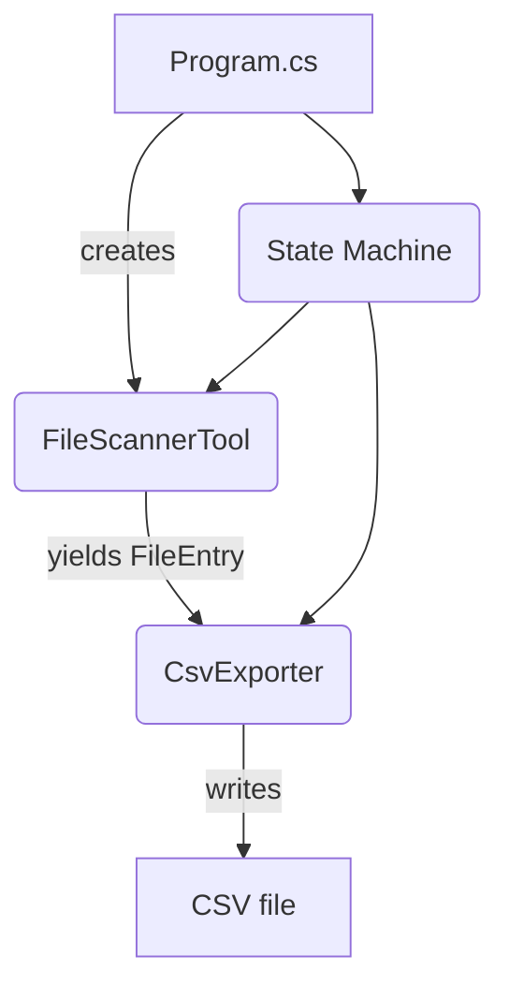
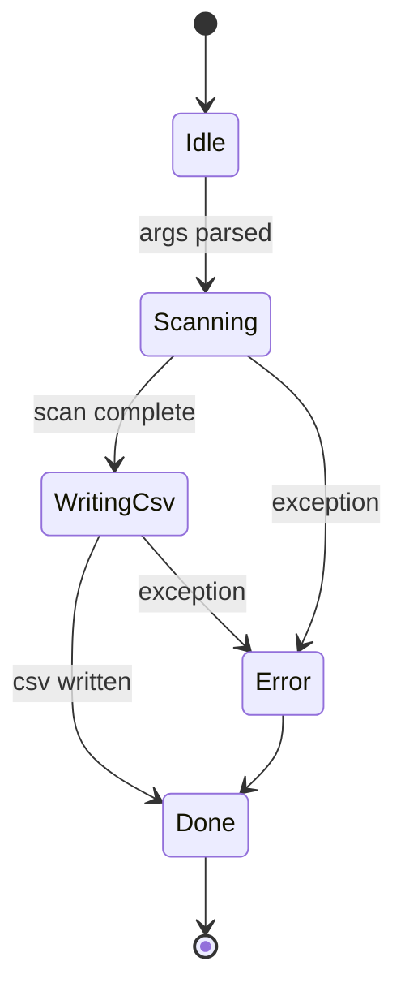

# FileScanner


> **FileScanner** is a cross-platform C#/.NET 9 console utility that **recursively scans a directory tree, applies powerful filename/extension filters and exports the results to CSV**.  
> It is architected around a simple state-machine and cleanly separated components so it remains easy to extend (progress bar, multithreading, GUI, cloud upload… you name it).

---

## Table of Contents
1. [Features](#features)
2. [Quick start](#quick-start)
3. [Command-line reference](#command-line-reference)
4. [Sample output](#sample-output)
5. [Architecture deep dive](#architecture-deep-dive)
6. [Build, test & publish](#build-test--publish)
7. [Troubleshooting / FAQ](#troubleshooting--faq)
8. [Road-map](#road-map)
9. [Contributing](#contributing)
10. [License](#license)

---

## Features

| Area | Details |
|------|---------|
| **Recursive scanning** | Breadth-first traversal avoids deep recursion stack overflows and gracefully skips _access-denied_ / _path-too-long_ errors |
| **Filters** | `--contains` substring match on **filename**, `--filter` list of extensions (`.log,.txt`, etc.) |
| **Fast** | No LINQ heavy materialisation – each matching file streams out as a `FileEntry` (lazy iterator) |
| **CSV export** | Escapes commas/quotes, writes header + rows (`FullPath,SizeBytes,LastModifiedUtc`) |
| **State machine** | `Idle → Scanning → WritingCsv → Done` (or `Error`) keeps responsibilities isolated |
| **Self-contained publish** | Single-file `.exe` / ELF / Mach-O bundles – no pre-installed .NET runtime needed |
| **Cross-platform** | Builds & runs on Windows, Linux, macOS (x64/arm64) |

---

## Quick start

### 1. Prerequisites
* [.NET SDK 9 preview](https://dotnet.microsoft.com/download/dotnet/9.0) – `dotnet --version` should print `9.*`

```powershell
# Windows (winget)
winget install Microsoft.DotNet.SDK.9 -e
```

### 2. Clone & run
```powershell
# Clone
 git clone https://github.com/<your-org>/FileScanner.git
 cd FileScanner/FileScanner

# Build
 dotnet build

# Run – scan current directory for every file
 dotnet run --
```

---

## Command-line reference

| Option | Example | Description |
|--------|---------|-------------|
| `--root <path>` | `--root "D:\Logs"` | Root directory to start scanning (defaults to current working directory) |
| `--contains <substr>` | `--contains error` | Only include files whose **name** (not path) contains this substring (case-insensitive) |
| `--filter <exts>` | `--filter .log,.txt` | Comma/semicolon/space separated list of extensions to include. Dot is optional (`.log` or `log`). |
| `--help` | | Prints basic usage information |

**Order-independent** – options may appear in any order.

> *Tip*: wrap arguments with spaces in quotes, e.g. `--root "C:\Program Files"`.

### Examples
```powershell
# 1) All *.cs files that mention "Program" under the repo
 dotnet run -- --filter=.cs --contains Program

# 2) Deep scan an external drive & save big CSV
 dotnet run -- --root "E:\" --filter .jpg .png .gif
```

---

## Sample output
```
FullPath,SizeBytes,LastModifiedUtc
"D:\Logs\app-error.log",179232,2025-08-06T04:22:11.0000000Z
"D:\Logs\service-error.log",9912,2025-08-05T19:14:34.0000000Z
```
The CSV is created in the working directory with a timestamped name, e.g. `FileScanResults_20250806_053927.csv`.

---

## Architecture deep dive

### Project layout
```
FileScanner/
├── FileEntry.cs         // Immutable record: (FullPath, SizeBytes, LastModifiedUtc)
├── FileScannerTool.cs   // Core BFS scanner + filters
├── CsvExporter.cs       // CSV writer utility
├── Program.cs           // Entry point, CLI parser, state-machine
└── FileScanner.csproj   // SDK-style project targeting net9.0
```

### Component diagram (Mermaid)


### State-machine diagram


### How scanning works (step-by-step)
1. **Queue initial root** → `Queue<string> dirs = new()`; enqueue root.
2. **While queue not empty**  
   a. `Dequeue()` current dir.  
   b. `EnumerateDirectories` → enqueue sub-dirs.  
   c. `EnumerateFiles` → for each file:  
      • check `Contains` filter  
      • check extension set  
      • `yield return new FileEntry(...)`
3. **Caller** (`Program`) materialises results with `ToList()` only once scanning is done.

> BFS avoids stack-overflow in insanely deep directory trees (e.g., node_modules).

---

## Build, test & publish

### Build / run
```bash
# Debug build
 dotnet build
# Run (see CLI reference for args)
 dotnet run -- --root /var/log --filter=.log
```

### Release publish (self-contained)
```bash
# Windows x64 single-file
 dotnet publish -c Release -r win-x64 \
   -p:PublishSingleFile=true -p:SelfContained=true -p:PublishTrimmed=true

# Linux x64 single-file
 dotnet publish -c Release -r linux-x64 -p:PublishSingleFile=true -p:SelfContained=true
```
The output folder (`bin/Release/net9.0/<rid>/publish`) contains a single executable you can copy anywhere.

### Packaging for winget/Chocolatey (optional)
1. Publish as above → obtain EXE.  
2. Create a NuGet manifest `.nuspec`/winget YAML referencing the artefact.  
3. Push to the corresponding repo.  *(See docs in `.github/packaging`)*

### Unit tests
The project is structured so logic can be unit-tested – add a **FileScanner.Tests** project using:
```bash
 dotnet new xunit -n FileScanner.Tests
 dotnet add FileScanner.Tests reference FileScanner.csproj
 dotnet add FileScanner.Tests package System.IO.Abstractions
```

---

## Troubleshooting & FAQ
| Symptom | Cause / fix |
|---------|-------------|
| `It was not possible to find any installed .NET Core SDKs` | Install .NET SDK 9 and restart terminal (`dotnet --version` should print 9.*) |
| Some paths get **Access denied** errors | Scanner already skips them and continues; run shell elevated if you must include them |
| Output CSV garbled in Excel | Paths containing commas/quotes are fully escaped, but older Excel needs **Data → From Text** import with UTF-8 |
| Scan extremely slow on network share | Use `--filter` to narrow file set, or build the planned parallel scanning feature |

---

## Road-map
* Replace custom argument parser with **System.CommandLine** (rich `--help`, validation, tab completion)
* Parallel scanning using `Parallel.ForEach` + async I/O
* Progress bar with ETA (`ShellProgressBar`)
* Additional exporters: JSON, SQLite, HTML report
* Structured logging via **Serilog** (console + rolling file)
* GitHub Actions CI workflow – build, test, publish artefacts on tag

Feel free to open an issue or create a PR if you’d like to see something implemented!

---

## Contributing
1. Fork the repo, create a branch `feature/<name>`.
2. `dotnet format` before committing to satisfy analyzers.
3. Ensure `dotnet build` & any tests pass.
4. Open a PR – small, focused changes preferred.
5. All contributions are licensed under the MIT license (see below).

Need help?  Open an issue and we’ll figure it out together.

---

## License

`FileScanner` is released under the **MIT License** – see [LICENSE](LICENSE) for full text.
